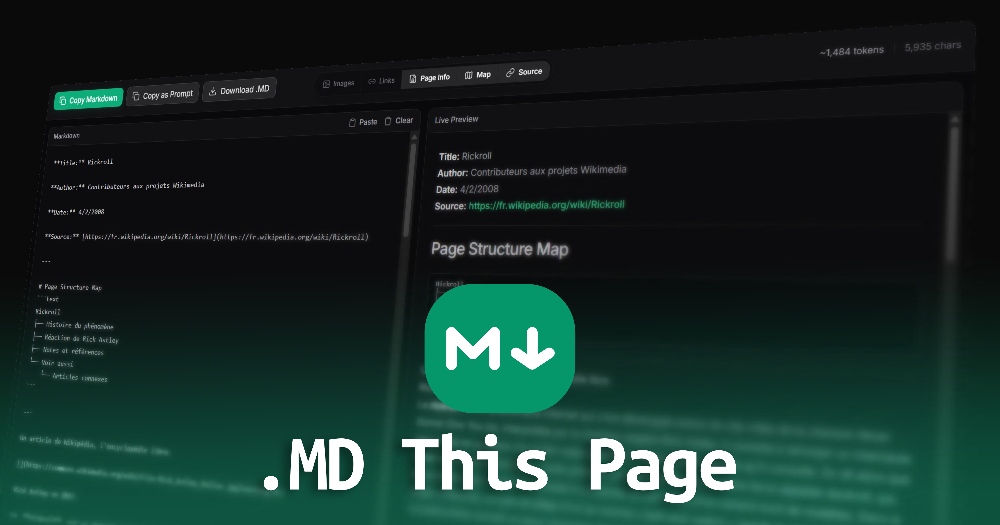

# .MD this page

Convert any web page to clean, readable Markdown with just one click.



**.MD this page** is a browser extension that extracts the main content of an article or webpage, removes clutter, and converts it into well-formatted Markdown.

## Why Markdown (and why it matters for LLMs)

Modern LLMs perform significantly better when content is provided in clean, structured Markdown instead of raw HTML or cluttered webpage data.

HTML pages include navigation bars, scripts, ads, and deeply nested DOM structures that add noise and consume context window without adding meaning. This extension solves that by converting pages into a simplified, structured format that is easier to process and reason about.

**Benefits for LLM workflows:**

- **Less noise, more signal:** Removes ads, UI elements, and boilerplate content that distract from the main text.
- **Better structure understanding:** Headings, lists, and sections are preserved in a format LLMs naturally interpret well.
- **Token efficiency:** Markdown is significantly more compact than HTML, helping fit more useful content into limited context windows.
- **Improved reasoning quality:** Clean hierarchical formatting makes it easier for models to summarize, extract, and answer questions accurately.
- **Reliable parsing:** Unlike raw HTML, Markdown avoids deeply nested or inconsistent DOM structures that can confuse extraction pipelines.

**In short:** this extension turns “web pages” into “LLM-ready documents.”

## Features

- **One-Click Conversion:** Use the context menu (right-click) or the keyboard shortcut (`Alt+M`) to instantly convert the current page.
- **Smart Extraction:** Powered by Mozilla's Readability library to isolate the main content and ignore ads, navbars, and unnecessary elements.
- **Dedicated Preview Tab:** Opens a clean interface where you can view and refine the extracted Markdown.
- **Customizable Output:** Toggle various elements to tailor the Markdown to your needs:
  - Remove/Keep Images
  - Remove/Keep Links
  - Show/Hide Metadata (Title, Author, Date)
  - Show/Hide Source URL
  - Generate a Document Structure / Page Map
- **Export Options:**
  - Copy to clipboard
  - Download as a `.md` file
  - Copy as a prompt (useful for AI workflows)

## Try it out!

You can install the extension from [releases](https://github.com/Ademking/MD-This-Page/releases) or build it from source (see instructions below). Once installed, simply right-click on any webpage and select ".MD this page" to see the magic happen.

## Getting Started

This extension is built with [Plasmo](https://docs.plasmo.com/) and React.

### Prerequisites

- Node.js
- pnpm (or npm, yarn)

### Installation & Development

1. Clone the repository and navigate to the project directory:

   ```bash
   cd md-this-page
   ```

2. Install dependencies:

   ```bash
   pnpm install
   ```

3. Run the development server:

   ```bash
   pnpm dev
   ```

   _This will run the Plasmo dev server and generate a `build/chrome-mv3-dev` directory._

4. Load the extension in Chrome:
   - Go to `chrome://extensions/`
   - Enable **Developer mode**
   - Click **Load unpacked**
   - Select the `build/chrome-mv3-dev` directory from this project.

### Building for Production

To create a production build of the extension:

```bash
pnpm build
```

This will output the production-ready extension into `build/chrome-mv3-prod`.

## Built With

- [Plasmo](https://plasmo.com/) - Browser Extension Framework
- [React](https://reactjs.org/) - UI Library
- [Tailwind CSS](https://tailwindcss.com/) - Styling
- [@mozilla/readability](https://github.com/mozilla/readability) - Content extraction
- [Turndown](https://github.com/mixmark-io/turndown) - HTML to Markdown conversion

## License

MIT License

## Credits

Adem Kouki - [GitHub](https://github.com/Ademking)
