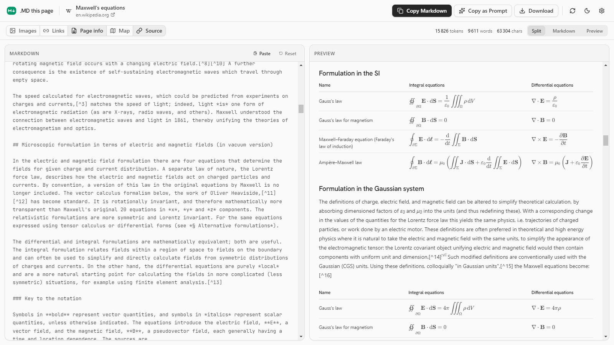

# .MD this page

> Turn any webpage into clean, LLM-ready Markdown in one click.  
> Strip the clutter, keep the structure, then copy or download instantly.



## Install

- **Chrome, Edge, Brave, Arc, Opera, Vivaldi:** [Chrome Web Store](https://chromewebstore.google.com/detail/md-this-page/banfcmclfmmlbkhionmemhibbjedhikm)
- **Firefox, Zen and other Gecko browsers:** [Firefox Add-ons](https://addons.mozilla.org/en-US/firefox/addon/md-this-page/)
- Or grab the zips from [GitHub Releases](https://github.com/Ademking/MD-This-Page/releases/latest)

<br/>

<div align="center">
  <a href="https://github.com/Ademking/MD-This-Page/releases/latest"></a>
  
  <a href="https://chromewebstore.google.com/detail/md-this-page/banfcmclfmmlbkhionmemhibbjedhikm"></a>
  <a href="https://addons.mozilla.org/en-US/firefox/addon/md-this-page/"></a>
</div>

### How it works

1. Open any webpage
2. Click the toolbar icon, right-click → **Open Preview Tab**, or press `Alt+M`
3. Get clean Markdown instantly — copy it, copy it as an LLM prompt, or download a `.md` file

## Why Markdown (and why it matters for LLMs)

Modern LLMs perform significantly better when content is provided in clean, structured Markdown instead of raw HTML or cluttered webpage data.

HTML pages include navigation bars, scripts, ads, and deeply nested DOM structures that add noise and consume context window without adding meaning. This extension solves that by converting pages into a simplified, structured format that is easier to process and reason about.

**Benefits for LLM workflows:**

- **Less noise, more signal:** Removes ads, UI elements, and boilerplate content that distract from the main text.
- **Better structure understanding:** Headings, lists, and sections are preserved in a format LLMs naturally interpret well.
- **Token efficiency:** Markdown is significantly more compact than HTML, helping fit more useful content into limited context windows.
- **Improved reasoning quality:** Clean hierarchical formatting makes it easier for models to summarize, extract, and answer questions accurately.
- **Reliable parsing:** Unlike raw HTML, Markdown avoids deeply nested or inconsistent DOM structures that can confuse extraction pipelines.

**In short:** this extension turns “web pages” into “LLM-ready documents.”

## Features

- **One-Click Conversion:** Click the toolbar icon, use the context menu (right-click), or press `Alt+M` to convert the current page.
- **Smart Extraction:** Powered by [Defuddle](https://github.com/kepano/defuddle) to isolate the main content and drop ads, navbars and other clutter. Works on client-side rendered apps (React, Angular, Vue…) and falls back to the whole visible page when a site isn't article-shaped.
- **Math & Code:** Equations (MathML, MathJax, KaTeX, Wikipedia) become LaTeX (`$…$` / `$$…$$`), code blocks keep their fences.
- **Dedicated Preview Tab:** A clean editor + live preview (with rendered math) where you can refine the Markdown before exporting. Split, Markdown-only and Preview-only layouts, light/dark theme, token/word/character counts, and a **Re-extract** button for pages that load more content after the fact.
- **Customizable Output:** Toggle what goes into the Markdown:
  - Images
  - Links
  - Page info (title, author, date)
  - Source URL
  - Page map (a tree outline of the page's headings)
- **Export Options:**
  - Copy to clipboard (`Ctrl/⌘+Shift+C` in the preview)
  - Download as a `.md` file (`Ctrl/⌘+S` in the preview)
  - Copy as a prompt — wrapped in a ` ```markdown ` fence for AI chats
- **Quick Actions:** Right-click the page _or_ the toolbar icon for "Copy Markdown", "Copy as Prompt", and "Download .MD" — these run instantly without opening the preview tab.
- **One-Click Toolbar Button:** In Options, enable "One-click action" to make a left-click on the toolbar icon immediately run your chosen quick action.
- **Options Page:** Choose the default content toggles, the one-click action, auto-copy and the theme. Settings sync across your signed-in browsers.

## Privacy & permissions

.MD this page only reads a page **when you ask it to**. There is no content script running on every website: the extractor is injected into the current tab only after you click the toolbar icon, use the context menu or press the shortcut. Everything happens locally — no page content is sent anywhere.

| Permission       | Why                                                                                       |
| ---------------- | ----------------------------------------------------------------------------------------- |
| `activeTab`      | Temporary access to the tab you just invoked the extension on. No broad host permissions. |
| `scripting`      | Inject the extractor into that tab on demand.                                             |
| `contextMenus`   | The right-click menu entries.                                                             |
| `storage`        | Your settings, and the conversion handed to the preview tab.                              |
| `clipboardWrite` | Copy the Markdown from the quick actions.                                                 |

## Browser support

| Browser                               | Status                                                            |
| ------------------------------------- | ----------------------------------------------------------------- |
| Chrome, Edge, Brave, Opera, Vivaldi   | ✅ Chrome Web Store build                                         |
| Arc                                   | ✅ (opens the preview in a popup window when Arc blocks new tabs) |
| Firefox, Zen and other Gecko browsers | ✅ Firefox Add-ons build                                          |
| Safari (macOS)                        | 🧪 Build it yourself, see [Safari](#safari)                       |

Browsers never let extensions read their own internal pages (`chrome://`, `about:`, the extension stores, the built-in PDF viewer). For local `file://` pages, enable **Allow access to file URLs** for the extension.

## Try it out!

Or you can install the extension from [releases](https://github.com/Ademking/MD-This-Page/releases) or build it from source (see instructions below). Once installed, click the toolbar icon (or right-click on any webpage → **Open Preview Tab**) to see the magic happen.


## Getting Started

This extension is built with [Plasmo](https://docs.plasmo.com/) and React.

### Prerequisites

- Node.js
- pnpm (or npm, yarn)

### Installation & Development

1. Clone the repository and navigate to the project directory:

   ```bash
   cd md-this-page
   ```

2. Install dependencies:

   ```bash
   pnpm install
   ```

3. Run the development server:

   ```bash
   pnpm dev
   ```

   _This builds the page extractor and runs the Plasmo dev server, generating a `build/chrome-mv3-dev` directory. If you change `lib/extract-page-data.ts`, run `pnpm build:extractor` (or `node scripts/build-extractor.mjs --watch` in a second terminal)._

4. Load the extension in Chrome:
   - Go to `chrome://extensions/`
   - Enable **Developer mode**
   - Click **Load unpacked**
   - Select the `build/chrome-mv3-dev` directory from this project.

### Building for Production

```bash
pnpm build           # build/chrome-mv3-prod
pnpm build:chrome    # + zip for the Chrome Web Store
pnpm build:firefox   # + zip for Firefox Add-ons
pnpm build:edge      # + zip for Edge Add-ons
pnpm build:all       # all of the above
pnpm typecheck
```

### Safari

You need a Mac with Xcode. Build the Safari target, then convert it into an Xcode project (thanks @alexvenzke):

```bash
pnpm install && pnpm build:safari
xcrun safari-web-extension-converter build/safari-mv3-prod   --project-location MDThisPage-Safari   --app-name "MDThisPage"   --bundle-identifier com.local.md-this-page   --no-prompt
```

Open `MDThisPage-Safari/MDThisPage/MDThisPage.xcodeproj`, set your signing team on both targets, then build and run. In Safari: **Settings → Advanced → Show features for web developers**, **Develop → Allow Unsigned Extensions**, then enable the extension in **Settings → Extensions**.

## Built With

- [Plasmo](https://plasmo.com/) - Browser Extension Framework
- [React](https://reactjs.org/) - UI Library
- [Shark UI](https://shark-ui.com/) - Components (built on [Ark UI](https://ark-ui.com/))
- [Tailwind CSS](https://tailwindcss.com/) - Styling
- [Defuddle](https://github.com/kepano/defuddle) - Content extraction and HTML to Markdown conversion
- [marked](https://marked.js.org/), [KaTeX](https://katex.org/) and [DOMPurify](https://github.com/cure53/DOMPurify) - Live preview

## License

MIT License

## Credits

Adem Kouki - [GitHub](https://github.com/Ademking)
